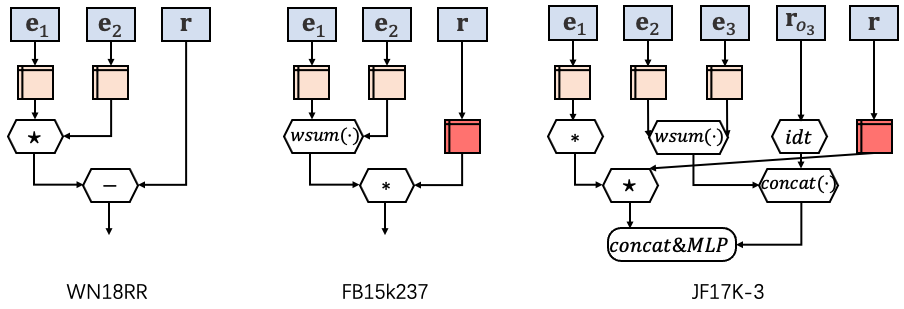

# MSeaHKG-data

<h2 align="center">
  The searched message functios in WN18RR, FB15k237, and JF17K-3
  
</h2>

As presented in \cite{rossi2021knowledge}, the irreflexive, anti-symmetric, and symmetric relations account for a major proportion of WN18RR and FB15k237, especially facts with the symmetric relations reach 37\% in WN18RR.
We found that the message function searched on WN18RR is the exact RotatE model, which has been proven to cover symmetric relations.

As for the message function searched on FB15k237, it first feeds the relation embedding into a transformation matrix $\mathbf{W}$.
We infer that is mainly because FB15k237 has 237 relations, which is more than 11 relations on WN18RR. 

For the message function searched on facts with high arity, we show an example on JF17K-3.
It demonstrates that the message function tends to be deeper and complex in the high arity case.
Note that the full version of message functions searched on WikiPeople ($N=9$)and JF17K ($N=6$) is too large to plot it.

